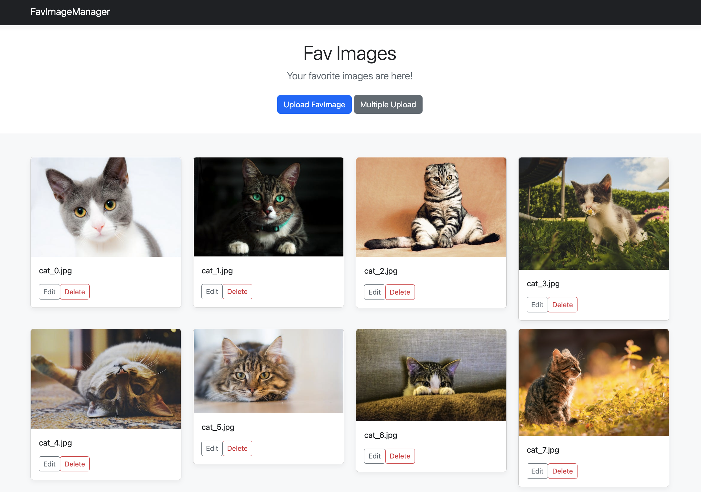

# FavImageManager



Manage your favorite images easily.

## Features

- View your favorite file list
- Upload a file with your favorite name
- Upload multiple files at once
- Edit the filename
- Delete files

## Requirements

- ruby: 3.0.x
- bundler: 2.2.x

## Quick Start

```console
$ bundle install
$ bundle exec rails:db:migrate
$ bundle exec rails server
```
